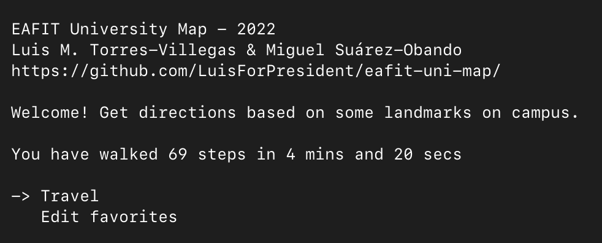
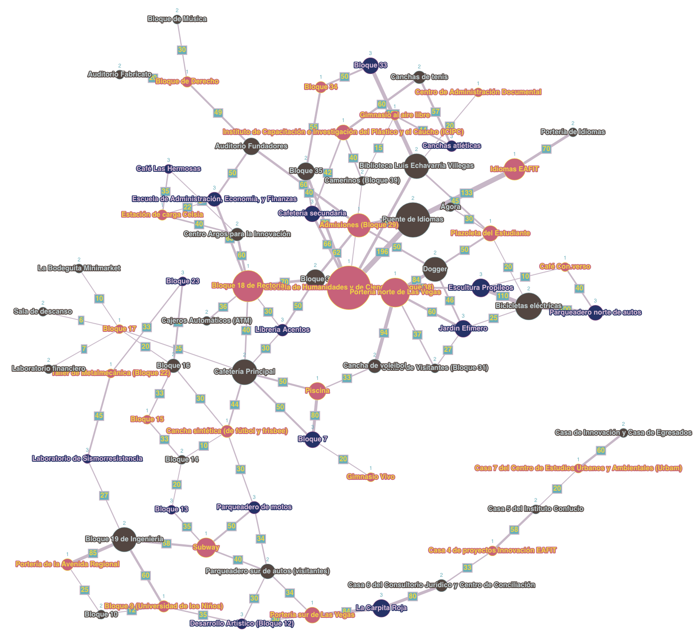

# eafit uni map •    

A curses based interactive program that gives you a list of directions between places located in the campus of the Universidad EAFIT.

## Screenshot



## Features
- 🗺 Get directions from one place to another
- ⭐️ Choose destination from your favorite places
- 💯 See steps and time estimates for the trip
- 📝 Edit your favorite places (add or remove)
- 🧐 See all-time stats (steps and time)

## Contributing
I'd appreciate critical feedback.

But I don't want to post my email (yet).

## Reason for being
As _the_ project for the practical course "Principles of Software Development" (ST0243).

Taught at EAFIT University (Medellín, Colombia).

By professor [Paola A. Vallejo-Correa](https://scholar.google.com/citations?user=S8xNhVoAAAAJ).

## Requirements
### System
Haven't tested yet… Works best on macOS and _probably_ Linux.

### Dependencies
1. `pick` for the "curses based interactive selection list in the terminal" 

2. `networkx` for [Dijkstra's algorithm](https://en.wikipedia.org/wiki/Dijkstra%27s_algorithm) 

## Authors
[Luis M. Torres-Villegas](https://www.github.com/LuisForPresident) and [Miguel Suárez-Obando](https://www.github.com/MSO2023).

## Run
```shell
# clone the repo
git clone https://github.com/LuisForPresident/eafit-uni-map.git

# change directory
cd eafit-uni-map

# install dependencies
python3 -m pip install -r requirements.txt

# change directory (again)
cd eafit-uni-map

# run
python3 main.py
```

## Caveats
- The working directory must be `eafit-uni-map/eafit-uni-map` or the paths won't be found.
- The font size is small. You have to zoom in manually.
- Probably doesn't work well in Windows (see the [Python docs](https://docs.python.org/3/howto/curses.html#what-is-curses))
- For an instant, while switching to the next screen, the terminal is visible.
- `KeyboardInterrupt` errors are not accounted for, i.e., `Ctrl-C` exits the program.
- There is no option to reset stats to 0. You have to do it manually.

## Graph


## License
[eafit-uni-map](https://github.com/LuisForPresident/eafit-uni-map/) is licensed under the BSD 3-Clause.

## Thanks
- [Wang Dàpéng](https://github.com/wong2) for the [`pick`](https://pypi.org/project/pick/) module
- [Viviana Hoyos-Sierra](https://github.com/Vivi-Hoyos2710) (TA) for the initial implementation of Dijkstra’s algorithm
- [Alejandro Ríos-Muñoz](https://github.com/alejoriosm04) for his helpful advice
