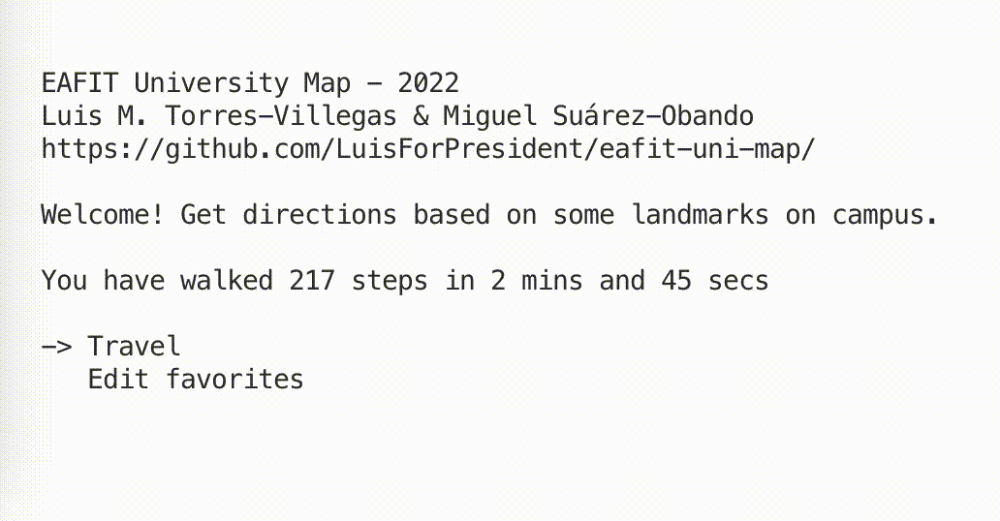

# EAFIT University Map

A Python application to get directions from A to B on EAFIT's main campus based on "landmarks", so to speak.

## Authors

- [Luis M. Torres-Villegas](https://www.gixthub.com/LuisForPresident)
- [Miguel Suárez-Obando](https://www.github.com/MSO2023)

## Why

Project for the first-semester course "Principles of Software Development" (ST0243) taught at EAFIT University (Medellín, Colombia) by prof Paola Vallejo.


## Demo



## Run Locally

1. Clone the project

    ```brainfuck
    # you should know how to do that xd
    ```

    > (Just kidding. I simply don't want bots cloning the repo.)

2. Go to the project directory (or wherever you stored it)

    ```bash
    $ cd eafit-uni-map
    ```

3. Install the 2 dependencies using `pip`

    ```bash
    $ pip install -r requirements.txt
    ```

4. Star the repository (xd).

5. Run the program (it's nested)

    ```bash
    $ python3 eafit-uni-map/main.py
    ```

- _To whoever tries to follow these steps:_

    I think the file path string literals won't work for you.

    I still have to fix that.

    (But, hey, it works on my machine!)

<!-- 
## Screenshots (pending)


## Lessons Learned

What did you learn while building this project? What challenges did you face and how did you overcome them?

1. GUIs are harder to create than they look.
2. Virtual environments are pretty useful.
3. Use LiveShare to code collaboratively.
4. Check your terminal config files.
5. Don't overdo it with the folders.
6. `CITATION.cff` is a thing
7. `brew update --auto-update` shouldn't exist. -->

## Appendix

### Related projects

- [Adrephos/EAFIT-maps](https://github.com/Adrephos/EAFIT-maps) (2021) [Java, JavaScript, Node.js, React]

- [sicomEAFIT/CampusMovil-EAFIT](https://github.com/sicomEAFIT/CampusMovil-EAFIT) (2015) [Objective-C, Java, Ruby]

### Contributing

Since this is the author’s coursework, I won't review pull requests.

### Feedback

Star the repo if you like it.

Stare at the screen if you don’t :)

### Acknowledgements

I’d like to thank:

- [Wang Dàpéng (@wong2)](https://github.com/wong2) for writing the [`pick`](https://pypi.org/project/pick/) module,
- [Viviana Hoyos-Sierra](https://github.com/Vivi-Hoyos2710) (TA) for the initial implementation of Dijkstra’s algorithm,

### Software requirements (in Spanish)

<details><summary>Structure</summary>

Los escribimos con esta estructura:

> El sistema debe
>
> \+ [verbo + objeto | frase verbal]
>
> \+ [complemento de agente | null]
>
> \+ {a) condición-1, b) condición-2, ... condición-n}
>

Fuente: Diapositivas de la semana 7

</details>

<details><summary>Entrada (Input)</summary>

* E1: El sistema debe recibir el punto inicial (ubicación) del usuario.

* E2: El sistema debe recibir el punto final (destino) del usuario.

* E3: El sistema debe permitir al usuario seleccionar el destino (E2) a partir de una lista de destinos favoritos (X1).

* E4: El sistema debe permitir al usuario agregar destinos como favoritos (E3) si existe al menos un lugar que no es favorito.

* E5: El sistema debe permitir al usuario remover destinos como favoritos (E3) si existe al menos un lugar que es favorito.

---

* NF-E1: El sistema debe permitir editar con facilidad los destinos favoritos.

* NF-E2: El sistema debe permitir volver a la pantalla de inicio o cerrar el programa si está en la pantalla de indicaciones.

</details>

<details><summary>Procesamiento (Processing)</summary>

* P1: El sistema debe encontrar la ruta más corta desde el punto inicial (E1) al final (E2).

* P2: El sistema debe calcular los pasos totales del usuario caminando del punto inicial (E1) al final (E2).

* P3: El sistema debe calcular el tiempo de recorrido del usuario caminando del punto inicial (E1) al final (E2).

---

* NF-P1: El sistema debe convertir las unidades con código entendible.

</details>

<details><summary>Salida (Output)</summary>

* S1: El sistema debe mostrar al usuario una lista de indicaciones del camino más corto (P1) desde la ubicación (E1) hasta el destino (E2).

* S2: El sistema debe mostrar la estimación de tiempo de recorrido caminando (P3) desde el punto inicial al final (P1) si está en la pantalla de indicaciones (S1).

* S3: El sistema debe mostrar la estimación de pasos caminando (P2) desde el punto inicial al final (P1) si está en la pantalla de indicaciones (S1) y ha calculado la ruta.

* S4: El sistema debe mostrar las estadísticas totales de los pasos (X2) y tiempo (X3) que ha caminado el usuario.

---

* NF-S1: El sistema debe mostrar esta guía de una manera concisa y fácil de entender. 

</details>

<details><summary>Persistencia (Persistence)</summary>

* X1: El sistema debe guardar los destinos favoritos del usuario (E4).

* X2: El sistema debe guardar los pasos totales que ha caminado el usuario (P2).

* X3: El sistema debe guardar el tiempo total que ha caminado el usuario (P3).

---

* NF-X1: El sistema debe almacenar los datos en un formato sencillo.

</details>

### License

Released under the BSD 3-Clause license (see [LICENSE.md](../LICENSE.md)):

Copyright (c) 2022, Luis M. Torres-Villegas All rights reserved.
